# DevPulse — Cloud-Native Microservices Platform


A production-grade cloud-native microservices platform demonstrating end-to-end DevOps skills across containerization, Kubernetes orchestration, CI/CD automation, Terraform infrastructure, and observability.

---

## 🧭 Architecture


```text
                         ┌──────────────────────────┐
                         │      GitHub Actions      │
                         │ build, test, push, deploy│
                         └────────────┬─────────────┘
                                      │
                                      ▼
┌──────────────┐             ┌────────────────┐             ┌────────────────────┐
│  Developer   │────────────▶│    AWS ECR     │────────────▶│      AWS EKS       │
│ git push/PR  │             │ service images │             │ Helm deployments   │
└──────────────┘             └────────────────┘             └─────────┬──────────┘
                                                                       │
                 ┌─────────────────────────────────────────────────────┼─────────────────────────────────────────────────────┐
                 ▼                                                     ▼                                                     ▼
        ┌────────────────┐                                   ┌────────────────┐                                   ┌────────────────────┐
        │  auth-service  │                                   │  url-service   │                                   │ analytics-service  │
        │ Node.js/Express│                                   │ Node.js/Express│                                   │  Node.js/Express   │
        │  PostgreSQL    │                                   │ MongoDB + Redis│                                   │    PostgreSQL      │
        └────────────────┘                                   └────────────────┘                                   └────────────────────┘

                 ┌──────────────────────────────────────────────────────────────────────────────────────────────────────────┐
                 │ Terraform: VPC, public/private subnets, NAT, EKS, node groups, ECR, IAM, security groups, remote state │
                 └──────────────────────────────────────────────────────────────────────────────────────────────────────────┘

                 ┌──────────────────────────────────────────────────────────────────────────────────────────────────────────┐
                 │ Monitoring: kube-prometheus-stack, Prometheus targets, Grafana dashboards, cluster and node metrics     │
                 └──────────────────────────────────────────────────────────────────────────────────────────────────────────┘
```

---

## 🧰 Tech Stack

| Area | Tools / Services |
|---|---|
| Backend | Node.js, Express |
| Microservices | `auth-service`, `url-service`, `analytics-service` |
| Databases | PostgreSQL, MongoDB, Redis |
| Containerization | Docker, multi-stage builds, non-root user, dumb-init |
| Orchestration | Kubernetes, AWS EKS v1.32 |
| Packaging | Helm, HPA, resource requests and limits |
| CI/CD | GitHub Actions |
| Infrastructure as Code | Terraform |
| Cloud | AWS, ap-south-1 |
| Registry | AWS ECR |
| Monitoring | Prometheus, Grafana, kube-prometheus-stack |
| Compute | EKS managed node groups, EC2 `t3.small` nodes |

---

## ✨ Features

- Three independent Node.js/Express microservices built for cloud-native deployment.
- JWT-based authentication service backed by PostgreSQL.
- URL shortener service using MongoDB for persistence and Redis for caching.
- Analytics service for click tracking and reporting with PostgreSQL.
- Production-style Dockerfiles with multi-stage builds, non-root users, and dumb-init.
- Kubernetes manifests and Helm chart for repeatable application deployment.
- Horizontal Pod Autoscaler configured with 2-10 replicas and 70% CPU target.
- GitHub Actions pipelines for build, test, ECR push, and EKS deployment.
- Terraform-managed AWS infrastructure with remote state.
- EKS cluster with managed node groups, IAM roles, OIDC provider, and EBS CSI driver.
- ECR repositories for all service images with lifecycle management.
- Prometheus and Grafana monitoring for cluster, node, and workload visibility.

---

## 📁 Project Structure

```text
devpulse/
├── services/
│   ├── auth-service/
│   ├── url-service/
│   └── analytics-service/
├── infrastructure/
│   ├── terraform/
│   │   ├── modules/
│   │   │   ├── vpc/
│   │   │   ├── eks/
│   │   │   └── ecr/
│   │   ├── main.tf
│   │   ├── variables.tf
│   │   ├── outputs.tf
│   │   ├── versions.tf
│   │   └── terraform.tfvars
│   └── helm/
│       └── devpulse/
│           ├── Chart.yaml
│           ├── values.yaml
│           └── templates/
├── .github/
│   └── workflows/
├── docker-compose.yml
└── README.md
```

---

## 🚀 Phase-by-Phase Delivery

| Phase | Focus | What Was Built |
|---|---|---|
| Phase 1 | Microservices Development | Built `auth-service`, `url-service`, and `analytics-service` from scratch with database integrations, health checks, local Docker Compose support, and inter-service communication. |
| Phase 2 | Docker & Containerization | Added optimized multi-stage Dockerfiles, `.dockerignore` files, non-root execution, dumb-init, and image size improvements. |
| Phase 3 | Kubernetes & Helm | Created Kubernetes Deployments, Services, ConfigMaps, Secrets, namespace isolation, Helm charts, resource requests/limits, and HPA rules. |
| Phase 4 | CI/CD with GitHub Actions | Automated build, test, Docker image publishing to ECR, and Helm-based deployment to EKS on merge to `main`. |
| Phase 5 | Terraform Infrastructure | Provisioned AWS VPC, public/private subnets, NAT, EKS, managed node groups, ECR, IAM roles, OIDC provider, EBS CSI driver, security groups, and remote state outputs. |
| Phase 6 | Monitoring | Deployed kube-prometheus-stack, configured Prometheus scraping, Grafana dashboards, metrics retention, and port-forward access for observability. |

---

## ☁️ AWS Resources Created

| Resource | Quantity / Details |
|---|---|
| VPC | 1 VPC in `ap-south-1` |
| Subnets | 2 public subnets, 2 private subnets across 2 AZs |
| EKS | 1 EKS cluster, Kubernetes v1.32 |
| Worker Nodes | 2 EC2 `t3.small` nodes |
| ECR | 3 repositories for service images |
| Networking | Internet Gateway, NAT Gateways, route tables |
| IAM | EKS roles, node roles, OIDC provider, EBS CSI permissions |
| Storage Addon | EBS CSI Driver addon |
| Monitoring | Prometheus and Grafana via Helm |

---

## 🖼️ Screenshots

### AWS and Kubernetes

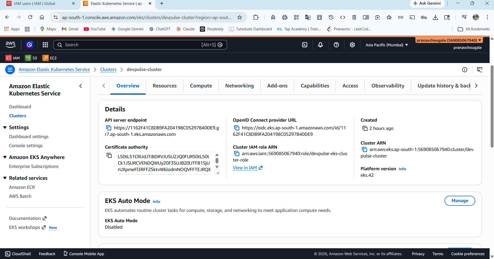

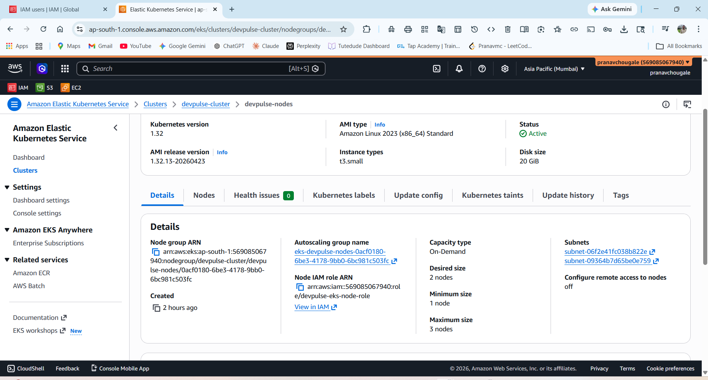

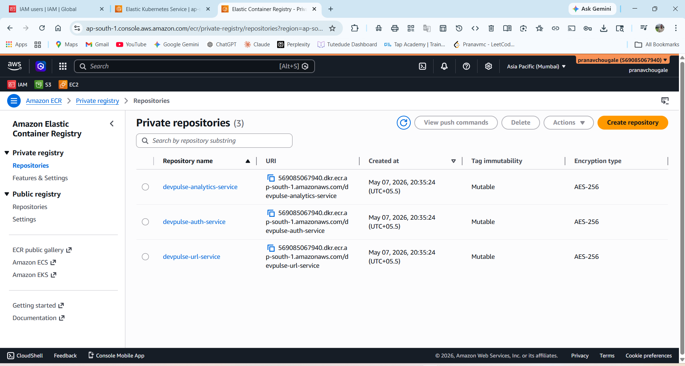

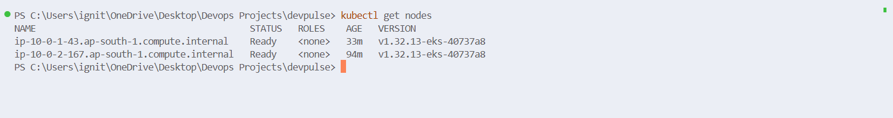

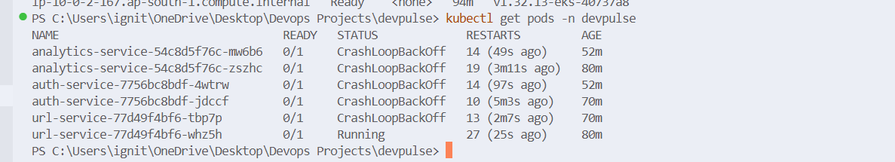

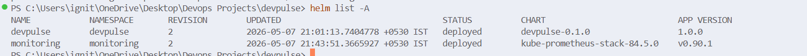

### CI/CD and Observability

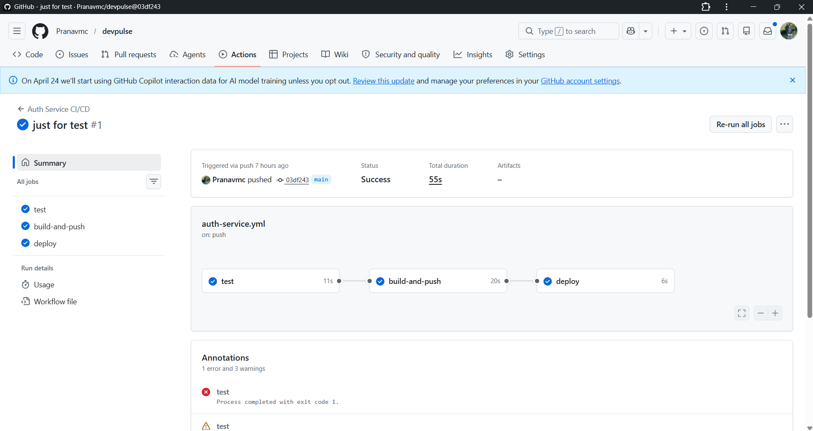

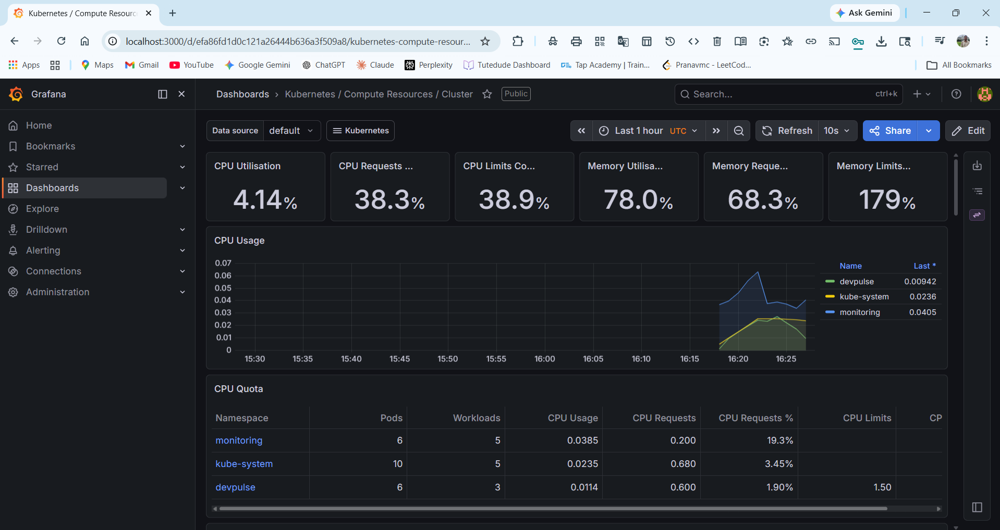


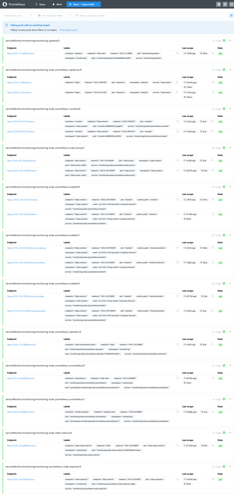

### Infrastructure and Local Development

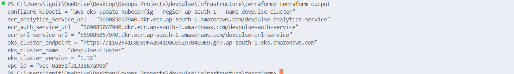

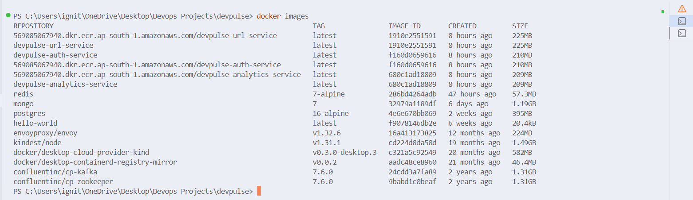


---

## 🧪 Run Locally

### Prerequisites

- Docker
- Docker Compose
- Node.js 20+ for local service development

### Start the platform

```bash
git clone <repo-url>
cd devpulse
cp .env.example .env
docker-compose up --build
```

### Verify services

```bash
curl http://localhost:3001/health
curl http://localhost:3002/health
curl http://localhost:3003/health
```

---

## 🏗️ Infrastructure Setup

### Prerequisites

- AWS CLI configured with valid credentials
- Terraform 1.0+
- kubectl
- Helm
- Existing S3 backend bucket for Terraform state

### Provision AWS infrastructure

```bash
cd infrastructure/terraform
terraform init
terraform validate
terraform plan
terraform apply
```

### Configure kubectl

```bash
aws eks update-kubeconfig --region ap-south-1 --name devpulse-cluster
kubectl get nodes
```

### Deploy application with Helm

```bash
helm upgrade --install devpulse ./infrastructure/helm/devpulse \
  --namespace devpulse \
  --create-namespace \
  -f ./infrastructure/helm/devpulse/values.yaml
```

### Deploy monitoring stack

```bash
helm repo add prometheus-community https://prometheus-community.github.io/helm-charts
helm repo update

helm upgrade --install monitoring prometheus-community/kube-prometheus-stack \
  --namespace monitoring \
  --create-namespace
```

### Access Grafana

```bash
kubectl port-forward svc/monitoring-grafana 3000:80 -n monitoring
```

Open Grafana at:

```text
http://localhost:3000
```

---

## 💸 Approximate AWS Cost Breakdown

| Resource | Approximate Monthly Cost |
|---|---:|
| EKS control plane | ~$72 |
| 2 x `t3.small` worker nodes | ~$30-$35 |
| NAT Gateways | ~$32+ each, plus data processing |
| EBS volumes | ~$5-$15 depending on size |
| ECR storage | Usually low for small images |
| Data transfer and logs | Usage dependent |

Estimated total for a small learning/demo environment:

```text
~$110-$160/month
```

> Costs vary based on uptime, region pricing, NAT Gateway usage, storage, log retention, and data transfer. Destroy unused infrastructure with `terraform destroy` when the environment is no longer needed.

---

## 📚 Key Learnings

- Designed a microservices architecture that separates authentication, URL management, and analytics responsibilities.
- Containerized production-style Node.js services with secure runtime practices.
- Built Kubernetes deployment workflows using manifests and Helm charts.
- Implemented autoscaling, resource constraints, namespace isolation, and service discovery.
- Automated CI/CD from source code to container registry to Kubernetes deployment.
- Provisioned AWS infrastructure using Terraform modules and remote state.
- Configured EKS, ECR, IAM, networking, and persistent storage components.
- Set up Prometheus and Grafana for operational visibility into cluster health and workloads.
- Practiced real-world DevOps troubleshooting across IAM, Terraform, Kubernetes, and Helm.

---

## 👤 Author

**Pranav M C**

- GitHub: [https://github.com/your-github-username](https://github.com/your-github-username)
- LinkedIn: [https://www.linkedin.com/in/your-linkedin-profile](https://www.linkedin.com/in/your-linkedin-profile)

---

## 📄 License

This project is licensed under the MIT License.
